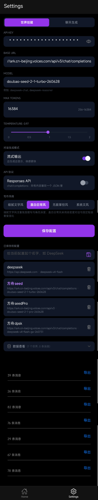
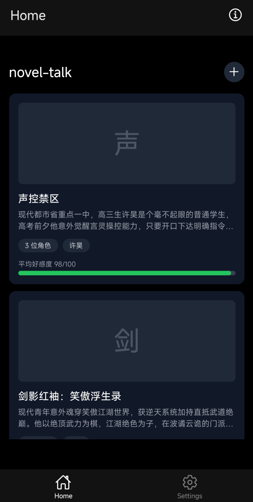
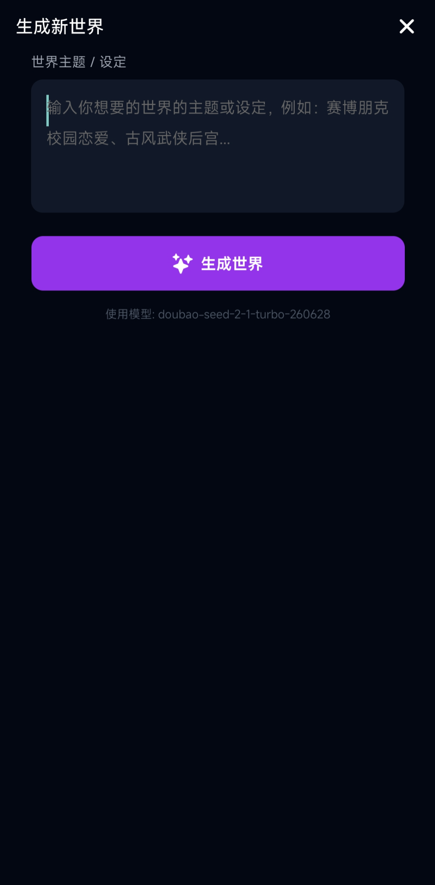
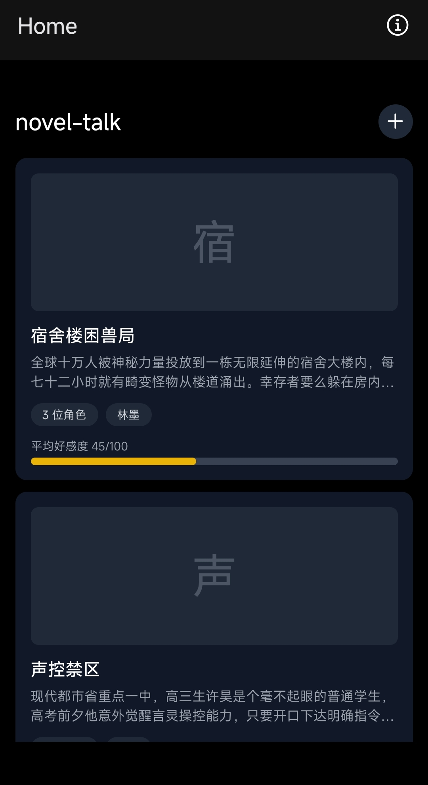
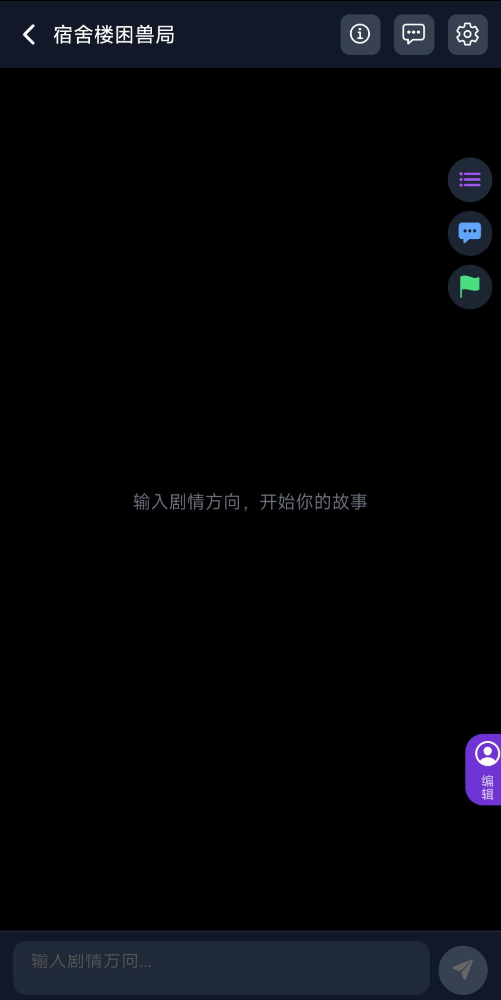
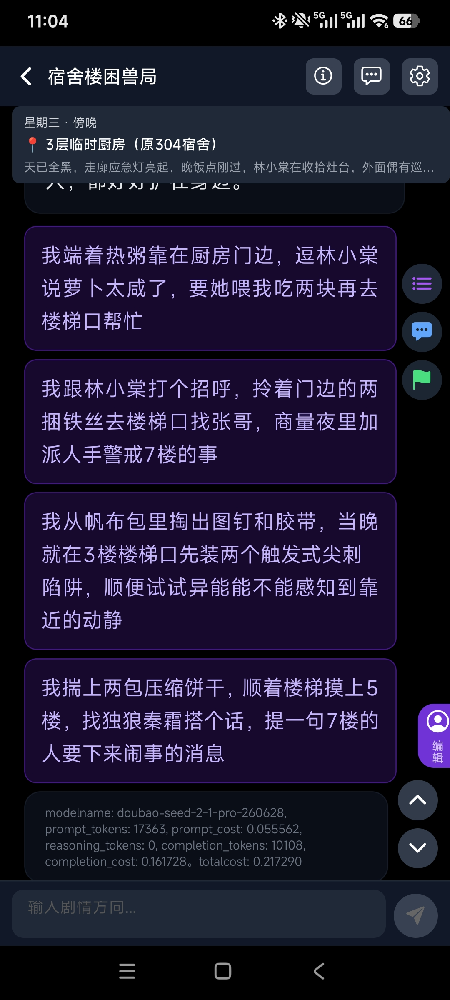
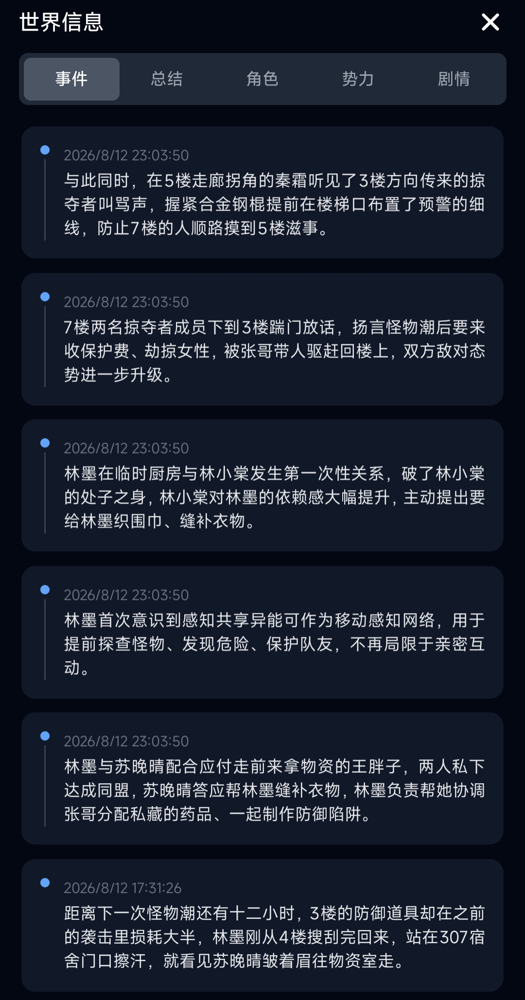
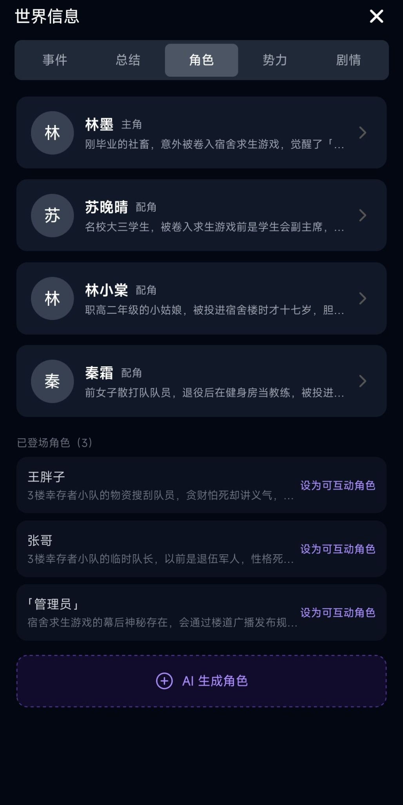

# novel-talk
AI-powered multi-world novel roleplay application built with React Native and Expo.

## 📖 项目简介
该项目是AI辅助编程。项目整体流程在后面介绍。项目的具体使用流程请参考 [🚀 快速开始](#-快速开始)。

这个项目是对话式的小说生成APP，设计理念是快捷方便。灵感来着于风月那个绅士APP，但是每一轮的我自己体验下来有点少，而且费用还很贵。

所以我在prompt拼接上和AI返回的内容上做了为了减少token消耗的相关处理:  
（比如在prompt拼接上只取最近两轮的AI返回内容作为衔接上下文，同时让AI每轮都返回发生事件event，npc与用户主视角扮演角色的等相关记忆，并储存在zustand里面作为历史对话记忆源，同时AI返回内容以message用 expo-sqlite 替代 AsyncStorage 做消息持久化，为回看历史或者导出服务），当然我自己做了绅士内容方面的prompt层面的调教。

实测下来，以deepseek的v4-flash这种便宜的模型为例子每轮token消耗花费大概在0.02——0.05。什么是便宜模型呢，像flash的输入prompt消耗token系数每百万1，complete生成内容消耗token系数是每百万2，后面会有例子讲解token消耗。

项目流程介绍：

1.配置setting页面的AI模型的参数，后面如何快速开始会介绍

2.生成小说对话世界逻辑：在home主页点击+进入生成世界页面，输入大概的世界，主角（也就是用户扮演角色），npc（分主要full和lite次要角色，full角色会有历史回忆等字段，更加立体和模型注意力占用，也是互动的主要角色）设定等描述，其实不怎么完全详细的描述也可以返回，现在模型都内置联网功能，会自己搜索揣摩用户意图。
点击生成后（豆包模型默认有思考模式，而且还很慢，可能要个几分钟。但是鲸鱼的模型也默认思考，但速度要比豆包快不少），生成完毕就能在home页面看到生成好的世界了。

3.点击世界开始对话逻辑：在主页点击世界选项卡后，进入chat聊天页面，就可以开始聊天了。该页面包含事件，总结，角色，势力与剧情的当前信息查看，短语映射块，过往轮数对话导航，短语快速填入（映射的完整内容会跟在userinput的末尾），用户自定义反馈模块（信息会拼接入prompt），主角信息快速更改悬扭。

# 🚀 快速开始

首次使用只需要完成 4 个步骤：配置模型 → 创建世界 → 开始故事 → 查看世界状态。

## 1. 配置 AI 模型

打开 **Settings** 页面，填写模型服务提供商提供的配置。

需要填写：

- **API Key**：前往模型服务商的官方平台实名认证之后，点击创建 API Key，然后填入此处。
  - [DeepSeek API](https://platform.deepseek.com/)
  - [火山方舟（豆包）](https://console.volcengine.com/ark)
- **Base URL**：接口地址（我做了一些正则的适配,所以这个baseurl像图片里面填完整也行）
  方舟：https://ark.cn-beijing.volces.com/api/v3
  鲸鱼：https://api.deepseek.com
- **Model**：模型名称（如 图片中的deepSeek-v4-flash、doubao-seed-2-1-turbo-260628等）
  以官方发布为准
- **MAX TOKENS** 是生成内容时最大的消耗token，可以粗略的认为生成字数的限制
- **Responses API** 这个协议并没有完全完成适配，等之后再摸索了。千万不要勾选这个选项。会报错。
- 其余参数可保持默认，点击 **保存配置** 即可。

---

## 2. 创建小说世界

回到 Home 页面，点击右上角 **+** 创建新世界。跳转创建世界页面。输入内容后点击生成。

  
   -----→ 
  

输入世界和角色设定即可，（但还是那句话，给的信息越详细AI返回的内容越贴合你的想象）

点击 **生成世界**，AI 会自动生成世界背景、主角、NPC 与初始剧情。

---

## 3. 开始故事

生成完成后，世界会出现在 Home 页面。点击世界卡片即可进入聊天页面。

  
   -----→ 
 

在底部输入剧情方向，AI 会继续推进小说剧情。附带四个选项和token消耗详情。

---

## 4. 查看世界状态

聊天过程中，可以随时打开 **世界信息** 查看当前状态。

  
   -----→ 
 

可查看：

- **事件**：重要剧情事件
- **总结**：阶段剧情概览
- **角色**：主角、NPC 与已登场角色
- **势力**：战力规划，组织与阵营关系 (该板块其实不太重要让AI在生成世界时规划生成，在信息不足时还是有点勉强，甚至胡说八道)
- **剧情**：当前主线推进状态（这个是AI自己维护的剧情导演模式，在用户没有给出具体的推进剧情思路时会自己推动剧情）
